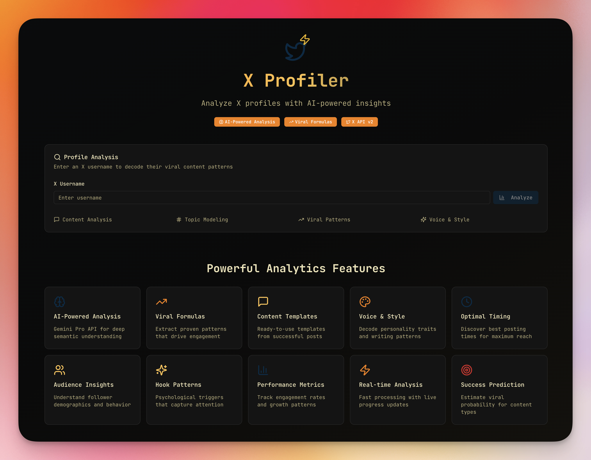

# X Profiler 🚀

[](https://github.com/aref-vc/x-profiler/releases)
[](./SECURITY.md)
[](./LICENSE)

An AI-powered Twitter/X profile analyzer that decodes viral content patterns and provides actionable insights for content creators. Built with Next.js 15.5.4, Shadcn/ui, X API v2, and Google Gemini AI.



**Version 2.0.0** - Major security update with zero vulnerabilities!

## Features

### 🎯 Core Analytics
- **Content & Semantic Analysis** - Deep NLP analysis of tweet content
- **Voice & Style Detection** - Personality traits and writing patterns
- **Viral Formula Extraction** - Hook patterns and engagement triggers
- **Template Generation** - Ready-to-use content templates
- **Engagement Intelligence** - Metrics, trends, and growth patterns

### 📊 Key Capabilities
- Real-time profile analysis with progress tracking
- Viral content pattern recognition
- Psychological trigger identification
- Optimal posting time detection
- Audience demographic insights
- Content mix optimization recommendations

## Tech Stack

- **Frontend**: Next.js 15, TypeScript, Tailwind CSS
- **UI Components**: Shadcn/ui with Radix UI
- **APIs**: X API v2, Google Gemini Pro
- **Styling**: Tailwind CSS with custom theme
- **Icons**: Lucide React

## 🔒 Security Features (v2.0.0)

- **Zero Vulnerabilities** - All security issues resolved
- **Secure API Management** - Server-side environment variables
- **Input Validation** - Protection against injection attacks
- **Security Headers** - CSP, X-Frame-Options, XSS Protection
- **No Exposed Secrets** - Comprehensive .gitignore protection

## Getting Started

### Prerequisites
- Node.js 18+ and npm
- X (Twitter) Developer Account
- Google AI Studio Account

### Installation

1. Clone the repository
```bash
git clone https://github.com/aref-vc/x-profiler.git
cd x-profiler
```

2. Install dependencies
```bash
npm install
```

3. Set up environment variables
```bash
cp .env.local.example .env.local
# Edit .env.local with your API keys
```

4. Start the development server
```bash
npm run dev
```

5. Open `http://localhost:3032` in your browser

6. Configure your API keys through the Settings dialog in the app (optional if using .env.local)

## Usage

1. **Enter Username**: Input any X/Twitter username (with or without @)
2. **Analyze**: Click analyze to start the AI-powered analysis
3. **View Results**: Explore comprehensive insights across multiple tabs:
   - Overview: Key metrics and engagement data
   - Voice & Style: Personality and writing analysis
   - Templates: Extracted viral formulas
   - Insights: AI-generated recommendations

## API Configuration

### X API v2 Setup
1. Go to [Twitter Developer Portal](https://developer.twitter.com)
2. Create a new app or use existing one
3. Generate Bearer Token
4. Add to `.env.local`

### Gemini API Setup
1. Go to [Google AI Studio](https://makersuite.google.com/app/apikey)
2. Generate API key
3. Add to `.env.local`

## Project Structure

```
X Profiler/
├── app/
│   ├── api/
│   │   └── analyze/         # Analysis API endpoint
│   ├── globals.css          # Global styles
│   ├── layout.tsx           # Root layout
│   └── page.tsx             # Home page
├── components/
│   ├── ui/                  # Shadcn UI components
│   ├── profile-analyzer.tsx # Main analyzer component
│   ├── analysis-results.tsx # Results display
│   ├── voice-analysis.tsx   # Voice & style analysis
│   └── template-library.tsx # Template generator
├── lib/
│   ├── services/
│   │   ├── x-api.ts        # X API integration
│   │   └── gemini-api.ts   # Gemini AI integration
│   ├── types.ts            # TypeScript types
│   └── utils.ts            # Utility functions
└── public/                  # Static assets
```

## Available Scripts

```bash
npm run dev      # Start development server (port 3032)
npm run build    # Build for production
npm run start    # Start production server
npm run lint     # Run ESLint
```

## Port Configuration

This application runs on **port 3032** as configured in the Claude Code port allocation system.

## 📚 Documentation

- [Architecture Overview](./docs/ARCHITECTURE.md) - Technical architecture and design
- [How-To Guide](./docs/HOW-TO.md) - Detailed usage instructions
- [Limitations](./docs/LIMITATIONS.md) - Current limitations and constraints

## 🎯 Features Roadmap

- [ ] Historical analysis tracking
- [ ] Competitor comparison
- [ ] Export reports (PDF/CSV)
- [ ] Scheduled monitoring
- [ ] Team collaboration features
- [ ] API access for developers
- [ ] Chrome extension
- [ ] Mobile app

## 🤝 Contributing

Contributions are welcome! Please feel free to submit a Pull Request.

## 📄 License

This project is licensed under the MIT License - see the [LICENSE](LICENSE) file for details.

## 🙏 Acknowledgments

- Built with [Next.js](https://nextjs.org/)
- UI components from [shadcn/ui](https://ui.shadcn.com/)
- Powered by [Google Gemini AI](https://ai.google.dev/)
- Data from [X API v2](https://developer.twitter.com/)

## 📧 Support

For issues or questions, please create an issue in the project repository.

---

Made with ❤️ by developers, for content creators